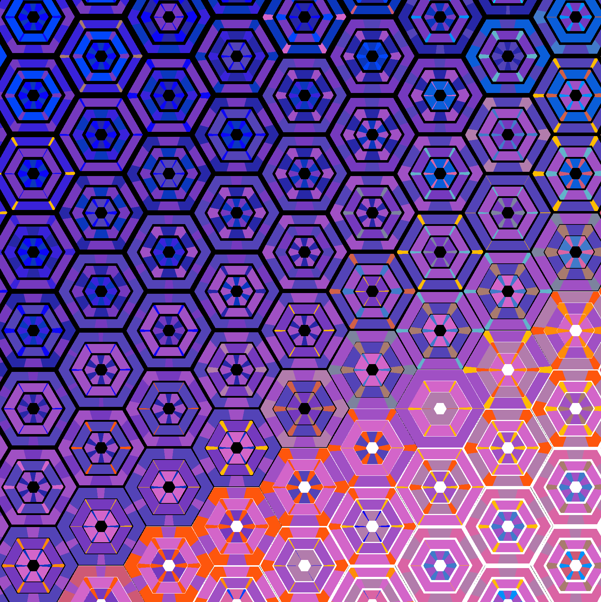

Hexify was a collaborative project between myself and GPT-4o in May of 2024.  Hexify applies a complex concentric hexagon grid pattern to images where the colors and geometry of each hexagonal cell are constrained to approximate the corresponding area of an input image.

Nearly the entire codebase was written by GPT-4o in response to my iterative prompting.  I occasionally made very small, simple edits to the code when I wanted to make a small change without waiting for GPT-4o to spit it all back out.  Breaking the functionality into manageable pieces and giving highly detailed prompts to GPT-4o were the keys to creating this.

There are a couple aspects to the code that are not ideal.  A couple times GPT-4o would produce outputs that weren't quite right and I found it much easier to get it to essentially write over its mistake rather than getting it to correct the mistake.  The two examples of this were the initial sizing and placement of the rows and columns of the hexagonal grid, and the clipping done in the fill_even_layer function. 

There are two python files.  hexify.py is the main program.  To run the script: "python hexify.py <input_image> [num_palette_colors]".  For example "python hexify.py colors.png 16".  This will produce a colors_out.png file.  I recommend 6-32 palette colors.  The default is 16.  The minimum is 5.  clean.py is a cleanup program that attempts to get rid of black pixel aliasing in the output images of hexify.py.  It signficantly cuts down the errant black pixels but does not get them all and also accidentally removes a small number of black pixels that it shouldn't have.  I recommend running this on your output images.  To run the script: "python clean.py <input_image>".  For example "python clean.py colors_out.png".  This will produce a colors_out_clean.png file. 

Here's an example section of colors_out.png.  You can see the black pixel aliasing in some of the cells where the background color turns from black to white.

After running clean.py, this is the output:

