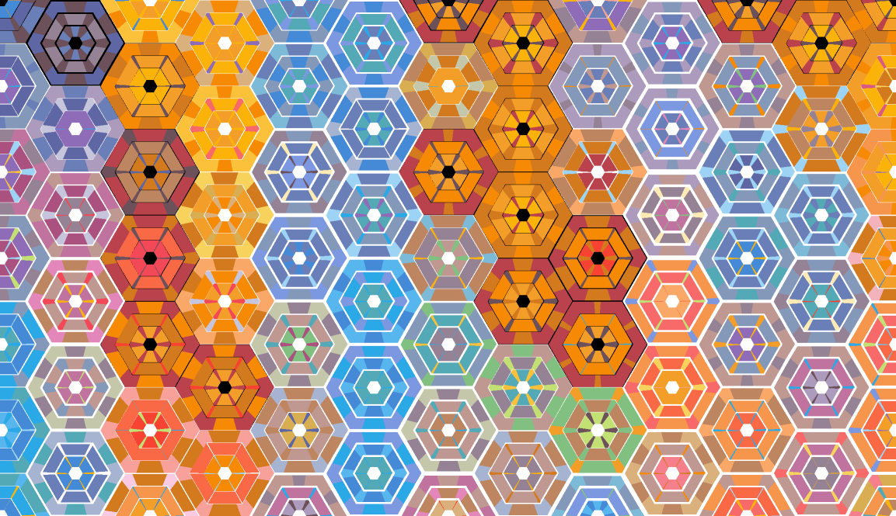
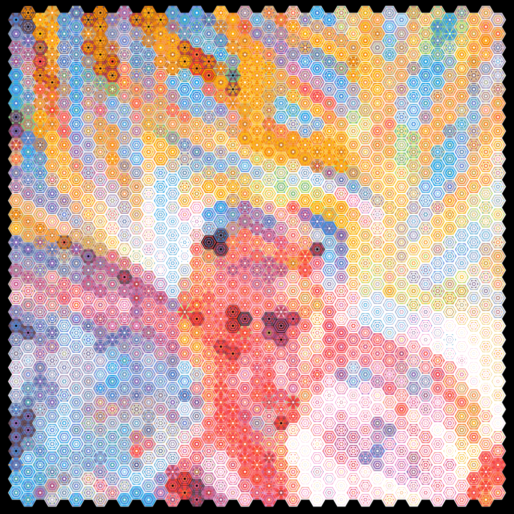

# Hexify

Hexify was a collaborative project between myself and GPT-4o in May of 2024.  Hexify applies a complex concentric hexagon grid pattern to images where the colors and geometry of each hexagonal cell are constrained to approximate the corresponding area of an input image.

Nearly the entire codebase was written by GPT-4o in response to my iterative prompting.  I occasionally made very small, simple edits to the code when I wanted to make a small change without waiting for GPT-4o to spit it all back out.  Breaking the functionality into manageable pieces and giving highly detailed prompts to GPT-4o were the keys to creating this.

There are a couple aspects to the code that are not ideal.  A couple times GPT-4o would produce outputs that weren't quite right and I found it much easier to get it to essentially write over its mistake rather than getting it to correct the mistake.  The two examples of this were the initial sizing and placement of the rows and columns of the hexagonal grid, and the clipping done in the fill_even_layer function. 

Claude 3.5 Sonnet was used to write nearly all of the code after the initial release.

## Usage

To use the program, run the following command:

```bash
python hexify.py <input_image_path> [-c COLORS] [-p PROCESSES]
```
- `<input_image_path>`: Path to the input image file.
- `-c, --colors`: Number of colors in the palette (default: 16, minimum: 5, I recommend 6-32).
- `-p, --processes`: Number of processes to use (default: number of CPU cores).

clean.py is a deprecated post-processing script that removed black aliasing between hexagons.  This bug has been fixed and clean.py is no longer needed.

I do not recommend running this on images larger than 1000x1000 pixels since the output size is 16x the size in both dimensions.  Re-size a large image to be much smaller if you want to use a large image.  The samples below were made from a 512x512 image.

Here's a section of the output that has been reduced to 50% of its output size.


Here's a full image output that has been reduced to 12.5% of its output size.
