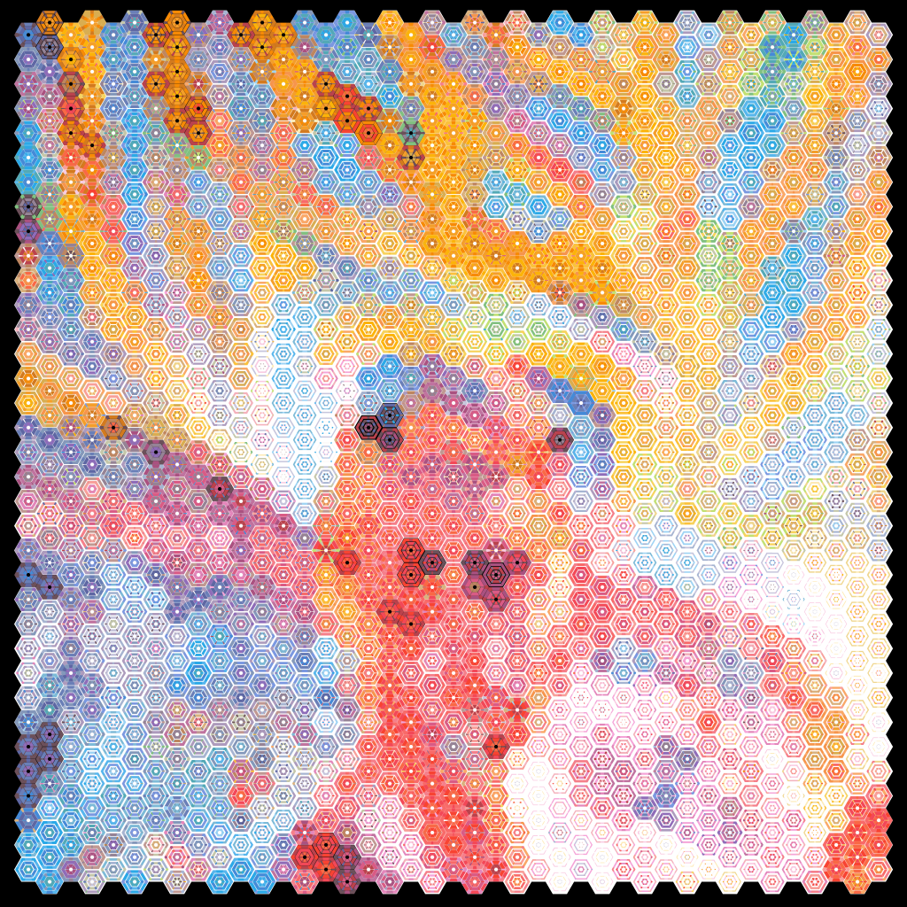

# Hexify v2

Transform images into stunning hexagonal pattern art with customizable color palettes, style effects, and high-resolution output.



## What's New in v2

Hexify v2 is a complete rewrite with a clean architecture, comprehensive test suite, and powerful new features:

- **Style Augmentation** - Borders, gradients, noise textures, and RGBA transparency
- **Modern CLI** - Batch processing, config files, and built-in presets
- **Configurable Architecture** - Full control over hexagon geometry, colors, and rendering
- **Performance Optimizations** - MiniBatch K-means and vectorized rendering
- **Production Ready** - Type hints, logging, custom exceptions, and 170+ tests

## Installation

```bash
# Clone the repository
git clone https://github.com/MatthewPDingle/Hexify.git
cd Hexify
git checkout v2

# Create virtual environment
python -m venv venv
source venv/bin/activate  # On Windows: venv\Scripts\activate

# Install dependencies
pip install -r requirements.txt

# Optional: Install development dependencies
pip install -e ".[dev]"
```

## Quick Start

### Python API

```python
from v2 import HexagonProcessor

# Basic usage
processor = HexagonProcessor(num_palette_colors=16)
output = processor.process_image(input_image)  # numpy array (H, W, 3)

# With style effects
from v2 import BorderStyle

processor = HexagonProcessor(
    num_palette_colors=16,
    style_params={
        "border_width": 2,
        "border_color": (0, 0, 0),
        "border_style": BorderStyle.SOLID,
        "noise_intensity": 0.03
    }
)
output = processor.process_image(input_image)

# RGBA output with transparent background
processor = HexagonProcessor(output_format="RGBA")
output = processor.process_image(input_image)  # (H, W, 4) with alpha channel
```

### Command Line

```bash
# Basic usage
python -m v2 input.png -o output.png

# With options
python -m v2 input.png -o output.png --colors 32 --jobs 8

# Using presets
python -m v2 input.png -o output.png --preset detailed

# With style effects
python -m v2 input.png -o output.png --border-width 2 --border-color 0,0,0

# Batch processing
python -m v2 input_dir/ -o output_dir/ --recursive
```

## Features

### Style Augmentation

Add visual effects to your hexagon patterns:

```python
from v2 import (
    add_hexagon_border,
    apply_radial_gradient,
    add_noise_texture,
    apply_alpha_channel,
    BorderStyle,
    STYLE_EFFECTS
)

# Border styles: NONE, SOLID, DOUBLE, GLOW
# Built-in style presets: classic, outlined, glowing, textured, neon, vintage, double_border
```

| Style | Description |
|-------|-------------|
| `classic` | No effects (original look) |
| `outlined` | 2px black solid border |
| `glowing` | 3px white glow effect |
| `textured` | 5% noise grain |
| `neon` | White glow with subtle noise |
| `vintage` | Noise with vignette darkening |
| `double_border` | 4px double-line border |

### Processing Presets

```bash
# Fast processing (MiniBatch K-means)
python -m v2 input.png --preset fast

# High detail (32 colors, more K-means iterations)
python -m v2 input.png --preset detailed

# Minimal (fewer layers and zones)
python -m v2 input.png --preset minimal
```

### Configuration System

Full control via `HexifySettings`:

```python
from v2 import HexifySettings, HexagonProcessor, ColorSpace, QuantizationMethod

settings = HexifySettings(
    hex_width=256,
    num_layers=7,
    num_zones=12,
    num_palette_colors=16,
    quantization_method=QuantizationMethod.MINIBATCH_KMEANS,
    color_space=ColorSpace.RGB
)

processor = HexagonProcessor(settings=settings)
```

Load/save settings from YAML or JSON:

```python
settings = HexifySettings.from_yaml("config.yaml")
settings.to_yaml("config.yaml")
```

## CLI Reference

```
python -m v2 [OPTIONS] INPUT [OUTPUT]

Arguments:
  INPUT                  Input image or directory
  OUTPUT                 Output path (optional)

Options:
  -c, --colors INT       Number of palette colors (default: 16)
  -j, --jobs INT         Number of parallel processes
  -p, --preset NAME      Use preset: default, fast, detailed, minimal
  --layers INT           Number of concentric layers (default: 7)
  --border-width INT     Border width in pixels (0 = none)
  --border-color R,G,B   Border color as comma-separated RGB
  --config FILE          Load settings from YAML/JSON file
  -r, --recursive        Process directories recursively
  -v, --verbose          Verbose output
  -h, --help             Show help message
```

## How It Works

Hexify transforms images through a multi-step process:

1. **Grid Setup** - Creates a hexagonal grid over the output (16x input size)
2. **Palette Extraction** - Uses K-means clustering to extract dominant colors
3. **Color Sampling** - Samples average color for each hexagon from input
4. **Layer Rendering** - Renders 7 concentric layers per hexagon:
   - Odd layers (7, 5, 3, 1): Solid background (black/white based on brightness)
   - Even layers (6, 4, 2): Angular zones mixing two palette colors
5. **Style Application** - Applies optional borders, gradients, and effects

The angular zone system approximates any color by varying the ratio of two palette colors across 12 zones, creating a visual color blend.

## Architecture

```
v2/
├── __init__.py      # Public API exports
├── processor.py     # Main HexagonProcessor orchestration
├── color.py         # ColorPalette and color matching
├── geometry.py      # HexagonGrid and HexagonMask
├── layers.py        # LayerRenderer for pattern generation
├── config.py        # Constants and ConfigResolver
├── settings.py      # HexifySettings dataclass
├── presets.py       # Processing presets
├── styles.py        # Style augmentation functions
├── exceptions.py    # Custom exception hierarchy
└── cli.py           # Command-line interface
```

## Examples

### Basic Image Processing

```python
import cv2
from v2 import HexagonProcessor

# Load image
img = cv2.imread("photo.jpg")
img = cv2.cvtColor(img, cv2.COLOR_BGR2RGB)

# Process
processor = HexagonProcessor(num_palette_colors=16)
output = processor.process_image(img)

# Save
cv2.imwrite("hexified.png", cv2.cvtColor(output, cv2.COLOR_RGB2BGR))
```

### Styled Output

```python
from v2 import HexagonProcessor, BorderStyle

processor = HexagonProcessor(
    num_palette_colors=24,
    style_params={
        "border_width": 3,
        "border_style": BorderStyle.GLOW,
        "border_color": (255, 255, 255),
        "noise_intensity": 0.02
    }
)
output = processor.process_image(img)
```

### Transparent Background

```python
processor = HexagonProcessor(
    num_palette_colors=16,
    output_format="RGBA"
)
output = processor.process_image(img)  # 4-channel with alpha
```

## Performance Tips

- Use `--preset fast` for quicker processing with MiniBatch K-means
- Reduce `--colors` for faster palette extraction
- Use `--jobs` to control parallelism (defaults to CPU count)
- Input images over 1000x1000 will produce very large outputs (16x scaling)

## Requirements

- Python 3.9+
- NumPy
- OpenCV (cv2)
- scikit-learn
- matplotlib

## History

Hexify was originally created in May 2024 as a collaboration between Matthew Dingle and GPT-4o. The v2 rewrite was completed in January 2025 with Claude Opus 4.5, featuring a clean architecture, comprehensive testing, and extensive new capabilities.

## License

MIT License - See LICENSE file for details.
